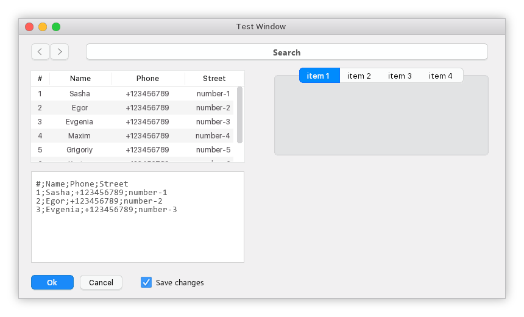

# component-sdl2

[-passed-brightgreen.svg)](https://i58215.gitbook.io/component-sdl2/)  [-passed-brightgreen.svg)](https://i58215.gitbook.io/component-sdl2-en/)  

## Description

`component-sdl2` is a small cross-platform library for creating interfaces created on the basis of the low-level graphics library `SDL2`. It supports the complete customization of the appearance of components using `css`, as well as the simple creation of custom components of any complexity.

## Examples

1. Windows in Windows :)

 

2. MacOS X in Windows :)

## Documentation
Russian language documentation is available [here](https://i58215.gitbook.io/component-sdl2/).

English language documentation is available [here](https://i58215.gitbook.io/component-sdl2-en/).

## Contact
Name: Petr Makhnev

E-Mail: mr.makhneff@gmail.com

Telegram: @petr_makhnev

## License

This library is released under the [MIT](https://github.com/i582/component-sdl2/blob/master/LICENSE) license. For more information refer to the [LICENSE](https://github.com/i582/component-sdl2/blob/master/LICENSE) file provided with this project.
