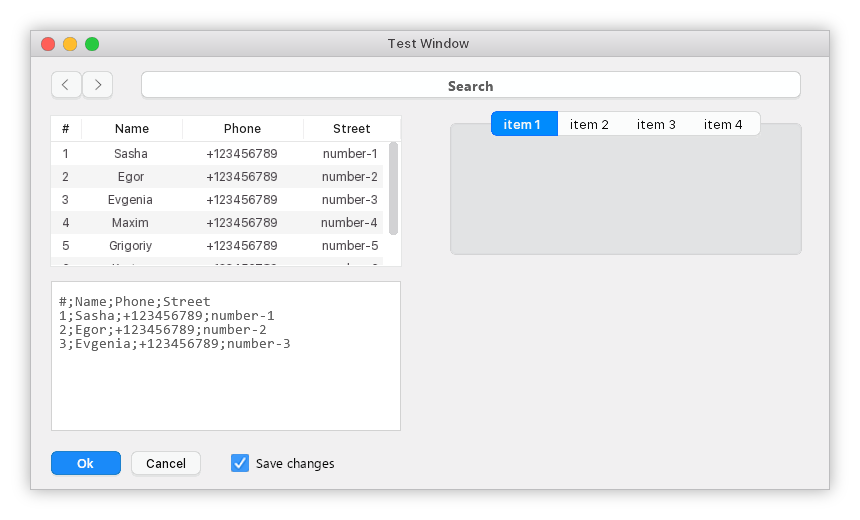

# component-sdl2


[](https://www.libsdl.org/)
[](https://www.boost.org/)

[-passed-brightgreen.svg)](https://i58215.gitbook.io/component-sdl2/)  [-in%20progress-inactive.svg)](#)  


## Description

`component-sdl2` is a small cross-platform library for creating interfaces created on the basis of the low-level graphics library `SDL2`. It supports the complete customization of the appearance of components using `css`, as well as the simple creation of custom components of any complexity.

## Examples

1. Windows in Windows :)

 

2. MacOS X in Windows :)




## Setup

### Setting boost (For GCC)

To support work with font search, `std::filesystem` is used, which is implemented in sufficient form in` Visual C++ `, but not in `GCC 8.2`, so `boost::filesystem` is used to support `filesystem`!

```bash
# download boost (https://www.boost.org) and go to the folder 
# with boost and run the next command

./b2

# The compilation of boost is quite long, so be patient.
```

### Setting SDL2 & SDL2_image & SDL2_ttf & SDL_gfx

```bash
# On Linux
sudo apt install build-essential cmake libsdl2-dev libsdl2-image-dev libsdl2-ttf-dev libsdl2-gfx-dev

# On Window
# Download from 
# 1. https://www.libsdl.org/
# 2. https://www.libsdl.org/tmp/SDL_ttf/
# 3. https://www.libsdl.org/tmp/SDL_image/
# 4. http://www.ferzkopp.net/wordpress/2016/01/02/sdl_gfx-sdl2_gfx/

# note: SDL2_gfx must be manually assembled.

# and unzip folders to your convenience.
```

### Preparation

```bash
git clone https://github.com/i582/component-sdl2.git
cd component-sdl2
git clone https://github.com/aminosbh/sdl2-cmake-modules
mv sdl2-cmake-modules cmake
cd test
git clone https://github.com/google/googletest

# for Window
# In CMakeLists.txt, write the paths to the folders with SDL2.

cd ../
mkdir build
cd build
cmake ..
cmake ..
cmake ..
cmake ..
cmake build .
```


## Links 
[Documentation (rus)](https://i58215.gitbook.io/component-sdl2/)

[(work in progress) Documentation (eng)](#)
## License

[MIT](https://github.com/i582/component-sdl2/blob/master/LICENSE)
