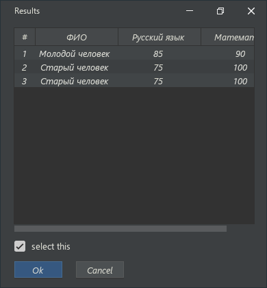

# component-sdl2

## Описание

`component-sdl2` это небольшая кроссплатформенная библиотека для создания интефейсов созданная на базе низкоуровневой графической библиотеки `SDL2`. Она поддерживает полную кастомизацию внешнего вида компонентов при помощи `css`, а так же простое создание кастомных компонентов любой сложности. 

## Пример интерфейса

## Ссылки 
[Документация](https://i58215.gitbook.io/component-sdl2/)

## Лицензия

MIT
