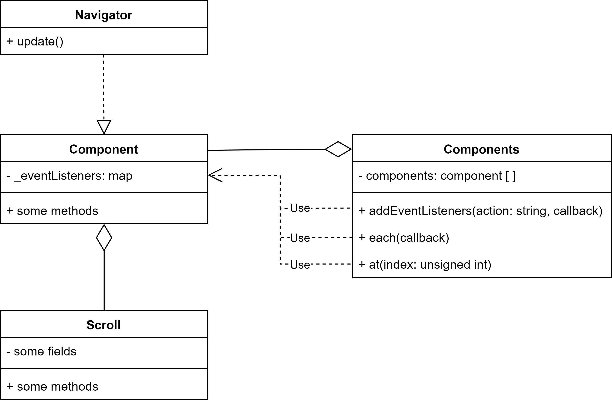
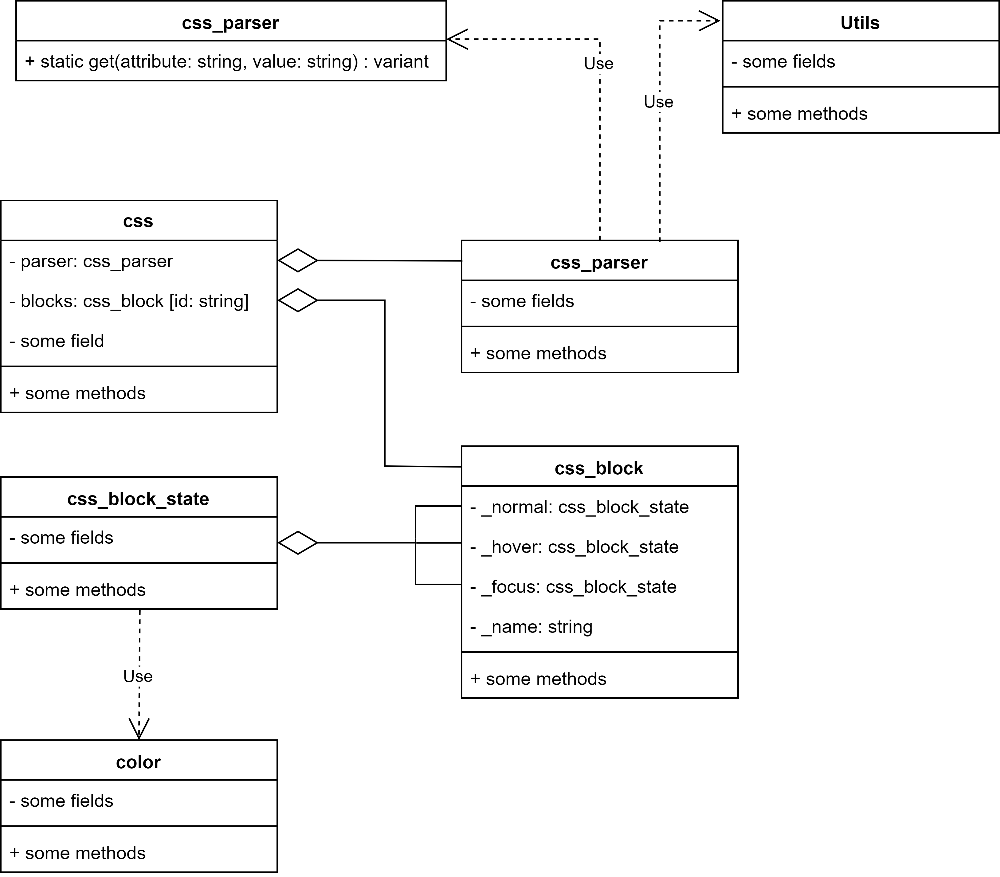

# Введение

Целью данной работы стало создание функциональной и простой в использовании GUI-библиотеки на базе низкоуровневой графической библиотеке `SDL` второй версии. Так же, вместе с основной библиотекой, были использованы библиотеки `SDL_ttf`, `SDL_image` и `SDL_gfx`.

В основу данной работы были положены некоторые принципы фреймворка `React` для создания клиентской части веб-сайтов.


# Техническое задание

Разработать GUI-библиотеку (GUI --- графический пользовательский интерфейс) на базе библиотеки `SDL2`, а так же, дополнительных к ней, библиотеках `SDL_*`. Библиотека должна предоставлять простой путь создания окон с возможностью наследования для создания собственных классов окон. Библиотека должна предоставлять базовый набор GUI компонентов (кнопка, флажок). Библиотека должна быть построена в объектно-ориентированной парадигме.


# Описание библиотеки

Библиотека написана на языке С++ с использованием графической библиотеки SDL2. В качестве IDE была использована Visual Studio 2019. В реализации библиотеки не были использованы специфичные возможности операционной системы Windows, что означает, что данная реализация является кроссплатформенной и может быть запущена на любой платформе поддерживаемой библиотекой SDL.

Для удобства разработки вся библиотека была распределена по отдельным папкам. Так вся библиотека расположена в папке `kit` со следующей иерархией:

```
---
   - component
       - components
            - components.h
            - components.cpp 
       - navigator
            - navigator.h
            - navigator.cpp 
       - scroll
            - scroll.h
            - scroll.cpp 
       - component.h
       - component.cpp
       - component-header.h
   - event
       - event.h
   - tools
       - css
            - color
                 - color.h
                 - color.cpp 
            - utils
                 - css_utils.cpp
                 - utils.h
            - css.h
            - css.cpp
            - css_block.h
            - css_block.cpp
            - css_block_state.h
            - css_block_state.cpp
            - css-attributes.h
            - css-attributes.cpp
            - css-parse.h
            - css-parse.cpp
       - font
            - font.h
            - font.cpp
       - image
            - image.h
            - image.cpp
       - point 
            - simple-point
                 - simple-point.h
            - extended-point
                 - extended-point.h
                 - extended-point.cpp
       - rect
            - simple-rect
                 - simple-rect.h
            - extended-rect
                 - extended-rect.h
                 - extended-rect.cpp
       - sdl_gfx
            - SDL2_gfxPromitives.c
            - SDL2_rotozoom.cpp
       - size
            - simple-size
                 - simple-size.h
                 - extended-size.cpp
            - extended-size
                 - extended-size.h
                 - extended-size.cpp
       - text
            - text.h
            - text.cpp
            - text-line.h
            - text-line.cpp
       - utils
            - utils.h
            - utils.cpp

   - window
       - window.h
       - window.cpp

   - kit.h
   - kit-main.h
   - kit-main.cpp
   - kit-enter-point

```


## Описание некоторых составных блоков

### Класс `Component` и его приложения

Класс `Component` предоставляет универсальный строительный блок интерфейса. На базе данного класса можно построить любой необходимый элемент интерфейса. Пример создания приведен в главе N. В дополнение к нему, имеются класс `Components`, который является оберткой над контейнером объектов класса `Component` для удобной работы с выборкой элементов, класс `Navigator` представляющий из себя класс-наследник для `Component` и использующийся в окне, как главный компонент, а также класс `Scroll` реализующий в себе логику работы скроллинга класса `Component`. 

Диаграмму взаимодействий данных классов можно представить следующим образом: 




### Класс `css` и его приложения

Класс `css` реализует логику хранения и обработки стилей для каждого из окон. Класс `css` включает в себя класс `css_parser` реализующий логику разбора css файлов со стилями. Так же включает в себя ассоциативную коллекцию объектов класса `css_block` реализующий логику хранения стилей для каждого из блоков в окне. Класс `css_block` хранит в себе три возможных состояния, такие как нормальное состояние, состояния при наведении курсора мыши и состояния нажатия на элемент. Эти состояния описываются классом `css_block_state`. В дополнение для этих классов есть еще класс `css_attribute` реализующий определение и возврат нужного типа для каждого значения по его аттрибуту.

Диаграмму их взаимодействия можно представить следующим образом:




### Класс `Window`

Класс `Window` реализует логику создания окон, а так же их наполнения компонентами интерфейса. Класс является базовым, от него можно унаследоваться для создания более комплексного класса окна, или для создания собственных окон с настраиваемым макетом. Подробнее о создании собственных классов Окна на базе класса `Window` в главе N.


### Дополнительный инструментарий

Для реализации тех или иных методов были созданы следующие вспомогательные классы:

1. Класс `Font` --- реализует логику работы со шрифтами;
2. Класс `Image` --- реализует логику работы с картинками;
3. Класс `Point` --- реализует хранение точки в программе;
4. Класс `Size` --- реализует хранение рамзеров в программе;
5. Класс `Rect` --- реализует хранение прямоугольника в программе;
6. Класс `Text` --- реализует логику работы с текстом;
7. Класс `Utils` --- реализует дополнительные функции.


# Использование библиотеки

Для использования библиотеки необходимо подключить файл `kit.h`

```cpp
#include "kit/kit.h"
```

И для удобства прописать 

```cpp
using namespace Lib;
```

так как вся библиотека находиться в пространстве имен `Lib`.

Далее, пользователь сразу получает доступ к объекту главного класса через короткое имя `$`.

Для запуска библиотеки необходимо вызвать функцию-член `run`.

Также, важно, функция main должна принимать две переменных: `int argc, char** argv`

```cpp
#include "kit/kit.h"
using namespace Lib;

int main(int argc, char** argv)
{
	$.run();
	return 0;
}

```

Здесь до вызова `run`, пользователь имеет возможность добавлять в приложение окна с помощью следующей функции-члена:

```cpp
addWindow(Window* window);
```

Пример добавления окна:

```cpp
#include "kit/kit.h"
using namespace Lib;

int main(int argc, char** argv)
{
	$.addWindow(new Window("new window", { 100, 100, 1000, 500 }));
	$.run();
	return 0;
}

```

Данная программа выведет пустое окно размерами 1000 на 500 пикселей с координатами 100, 100.
Но, это не интересно. Для добавления компонентов в окно, необходимо создать на базе класса `Window` свой класс окна.

Создадим папку `MyWindow` рядом с папкой `kit`. И создадим `MyWindow.h`.

Для наследования необходимо подключить заголовок с окном:

```cpp
#include "../kit/window/window.h"
```

После подключения создаем пустой класс и наследуем его от `Window`

```cpp
#pragma once

#include "../kit/window/window.h"
using namespace Lib;

class MyWindow : public Window
{
public:
	MyWindow(string title, SimpleRect size)
        : Window(title, size) 
    {
        setup();
    };

public:
	void setup()
    {

    }

};
```

Пока класс небольшой, реализацию можно писать в заголовочном файле для краткости.

Все что необходимо, это перегрузить конструктор и добавить функцию `setup` для настройки, которую надо вызвать в конструкторе. В данном случае, именно в функции `setup` добавляются новые компоненты интерфейса.

Теперь подключаем данный класс в `main.cpp` и создаем экземпляр.


```cpp
#include "kit/kit.h"

#include "MyWindow/MyWindow.h"

using namespace Lib;

int main(int argc, char** argv)
{
	$.addWindow(new MyWindow("new window", { 100, 100, 1000, 500 }));
	$.run();
	return 0;
}

```

Теперь перейдем к настройке интерфейса.

Изначально, пользователь может создавать только объекты базового класса `Component`. Рассмотрим класс повнимательнее.

Класс `Component` --- это комплексный класс для создания любых элементов управления. Рассмотрим простейшее применение. Учтем что у нас уже есть класс `MyWindow` и будем рассматривать только функцию `setup`. 

В каждом окне существует спициальный компонент `Navigator` который является главным для любого компонента интерфейса. В классе окна его можно использовать по короткому имени `$$` или по имени `navigator`.

Для добавления нового компонента, необходимо вызвать функцию `append` у навигатора.
 

```cpp
void setup()
{
    $$->append(new Component("#test-scroll", { 450, 30, 200, 300 }, ".outer-block");
}

```

Функция `append` принимает указатель на объект на основе класса `Component`. 

Класс `Component` имеет несколько конструкторов. Рассмотрим самый базовый. Первым параметром он принимает строку-идентификатор компонента, по которому его в дальнейшем можно будет найти. Важно, в окне не может быть двух компонентов с одинаковым идентификатором. Вторым параметром идут размеры компонента. Размеры можно указывать, как только числами, так и строками вида `20px` или `20%` при этом размер в процентах будет зависить от родительского. Так же поддерживаются записи вида `x + y` или `x - y`, например `100% - 20px`. 